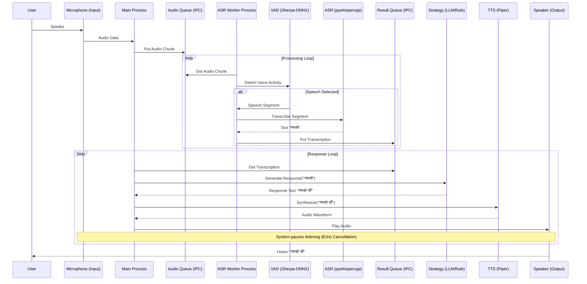

# Ahin - Hindi Voice Assistant

Ahin is a high-performance Hindi voice assistant using ONNX-based models for VAD, ASR (Whisper), and TTS (Piper). It is designed to run efficiently on CPU and provides a seamless conversational experience in Hindi.

## Features

- **VAD (Voice Activity Detection):** Silero VAD for robust speech detection.
- **ASR (Automatic Speech Recognition):** Whisper tiny/small models for accurate transcription.
- **TTS (Text-to-Speech):** Piper TTS with Hindi Rohan voice for high-quality natural speech.
- **LLM Integration:** Pluggable strategy for response generation (e.g., NVIDIA Nemotron).

## Prerequisites

- [uv](https://github.com/astral-sh/uv) - Python package and project manager.
- `wget` or `curl` (for downloading models).
- `tar` (for extracting models).

## Installation

Follow these steps to set up the project:

### 1. Sync Dependencies

Use `uv` to install all required dependencies:

```bash
uv sync
```

### 2. Download Models

Download the required VAD, ASR, and TTS models:

```bash
uv run download_models.py
```

This will create a `models/` directory and download approximately 500MB+ of model files.


## Running the Assistant

Once the models are downloaded and dependencies are synced, you can start the voice assistant:

```bash
uv run main.py
```

## Project Structure

- `main.py`: Entry point for the application.
- `download_models.py`: Script to fetch the necessary ONNX models.
- `ahin/`: Core logic for VAD, ASR, TTS, and assistant orchestration.
- `ahin/strats/`: Response generation strategies (conversational, semantic, etc.).
- [ARM Optimization & Hardware Tuning](ARMOPT.md): Technical details on optimizing for Raspberry Pi 4, overclocking, and performance comparisons.
- [Usage and Configuration](USAGE.md): Detailed documentation on project files and configuration settings.
- [Credits and Acknowledgments](CREDITS.md): Attribution for libraries and models used in the project.

## System Architecture


The following diagram illustrates the conversation flow through the system, highlighting the parallel processing between audio capture, speech recognition, and response generation.


